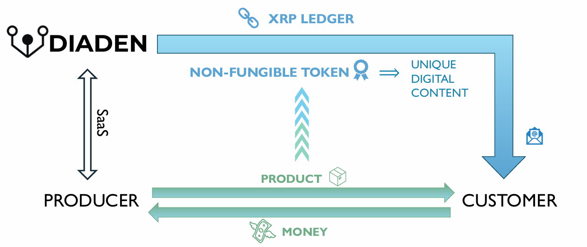
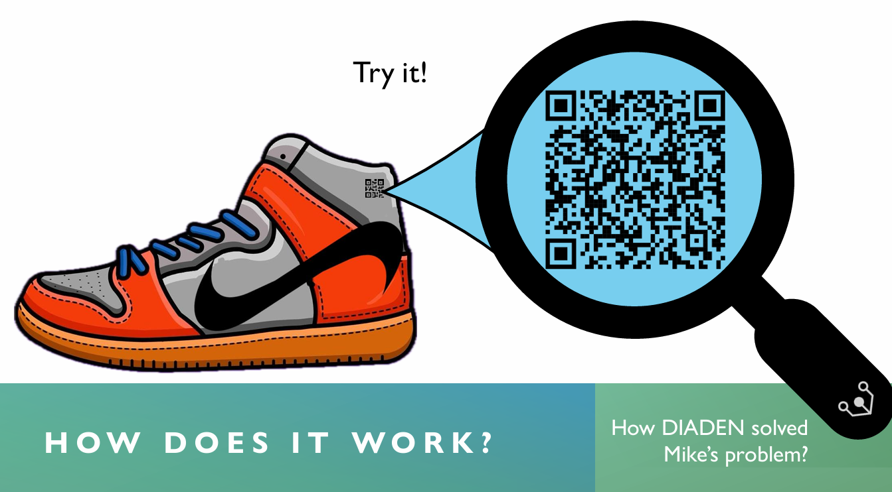

# Progetto per la Creazione di un NFT sulla Blockchain XRPL, con relativa Notifica

Questo progetto consente di creare un NFT sulla blockchain XRPL (XRP Ledger) e notificare l'utente che ha acquistato un oggetto fisico tramite un'email contenente i dettagli del wallet associato. Immaginando il processo di produzione di un bene all'interno di un'azienda,l'oggetto fisico acquistato è corredato da un QR code che collega l'utente sia ai dettagli del "prodotto fisico" che al corrispondente asset digitale (come, ad esempio, un avatar).

L'azienda di produzione, quindi, durante il processo di produzione si rivolge alla compagnia DIADEN per la creazione dell'NFT su XRPL, in maniera tale da aggiungere un valore ulteriore al prodotto fisico, garantendo tre punti fondamentali:

- AUTHENTICITY
- IDENTITY
- UNIQUE DIGITAL CONTENT

Di seguito riportiamo il diagramma di flusso che mostra:
- interazione DIADEN-Producer;
- interazione Producer-Customer;
- ruolo di DIADEN nel processo.



La seguente immagine, invece, è tratta dalla presentazione del progetto originale e mostra il QR code "marchiato" sull'oggetto prodotto:



## Struttura del Progetto

Il progetto è organizzato come segue:

nft-project/
- server.py           # Server FastAPI per gestire le richieste API
- utils.py            # Logica per interagire con la blockchain XRPL (raffinamento di test_func.py)
- email_utils.py      # Funzioni per inviare email tramite l'API di Mailjet
- main.py             # Script per l'utilizzo del sistema NFT
- test_func.py        # Script per testare le funzionalità XRPL (creazione wallet, NFT, offerte)
- test.http           # File per testare gli endpoint API con REST Client (non committato)
- mailjet_key.env     # Credenziali Mailjet (non committato)
- requirements.txt    # Elenco delle dipendenze Python essenziali

## Prerequisiti

1. Requisiti software:
    - Python versione 3.8 o versioni successive;
    - Mailjet API (account attivo);
    - Librerie richieste nel file requirements.txt

2. Configurazione Mailjet
    - Aggiungere le chiavi API di Mailjet al file mailjet_key.env
      ```
      MAILJET_API_KEY=la-tua-api-key
      MAILJET_API_SECRET=la-tua-secret-key
      
    - Assicurarsi che l'indirizzo email mittente sia verificato su Mailjet

## Installazione

1. Clone della repository Github;
2. Creazione dell'ambiente virtuale;
3. Installazione delle dipendenze;
4. Configurazione delle credenziali del servizio Mailjet.

## Test 1: creazione dell'NFT

1. Eseguire il file main.py, con output atteso del tipo:
      ```
      Everything ok
      wallet_receiver, NFT_token_id = (<xrpl.wallet.main.Wallet object at 0x...> 'number_value')

## Test 2: utilizzo del servizio Mailjet

1. Eseguire il file server.py per avviare il server;
2. Testare il servizio tramite un file test.http, fatto come segue:
    ```
    POST http://127.0.0.1:5000/nft HTTP/1.1\n
    content-type: application/json

    {
        "taxon": "1",
        "email_receiver": "utente@example.com"
    }

3. Eseguire la richiesta POST.

## Osservazioni

Tale progetto è una versione leggermente estesa e più dettagliata del progetto sviluppato dal Team UniNa dell'Università di Napoli Federico II, partecipante all'Hackathon 2024 basato sulla blockchain XRPL, tenutosi a Roma nel mese di Ottobre 2024. Gli autori del precedente progetto sono stati:
- Francesco Lucibello
- Davide Aruta
- Davide Brignola
- Luca Migliaccio
- Mario Pezzella
- Youssef Roudmane

## Riferimenti Github (progetto precedente)

- backend: https://github.com/Frollamma/IXH24-Hackathon (autori: Migliaccio Luca, Lucibello Francesco)
- frontend: https://github.com/roodeeex/diaden (autore: Youssef Roudmane)

## Riferimenti XRPL

- sito di riferimento della blockchain XRPL: https://xrpl.org/docs

## Autore

Progetto sviluppato da: Migliaccio Luca.
